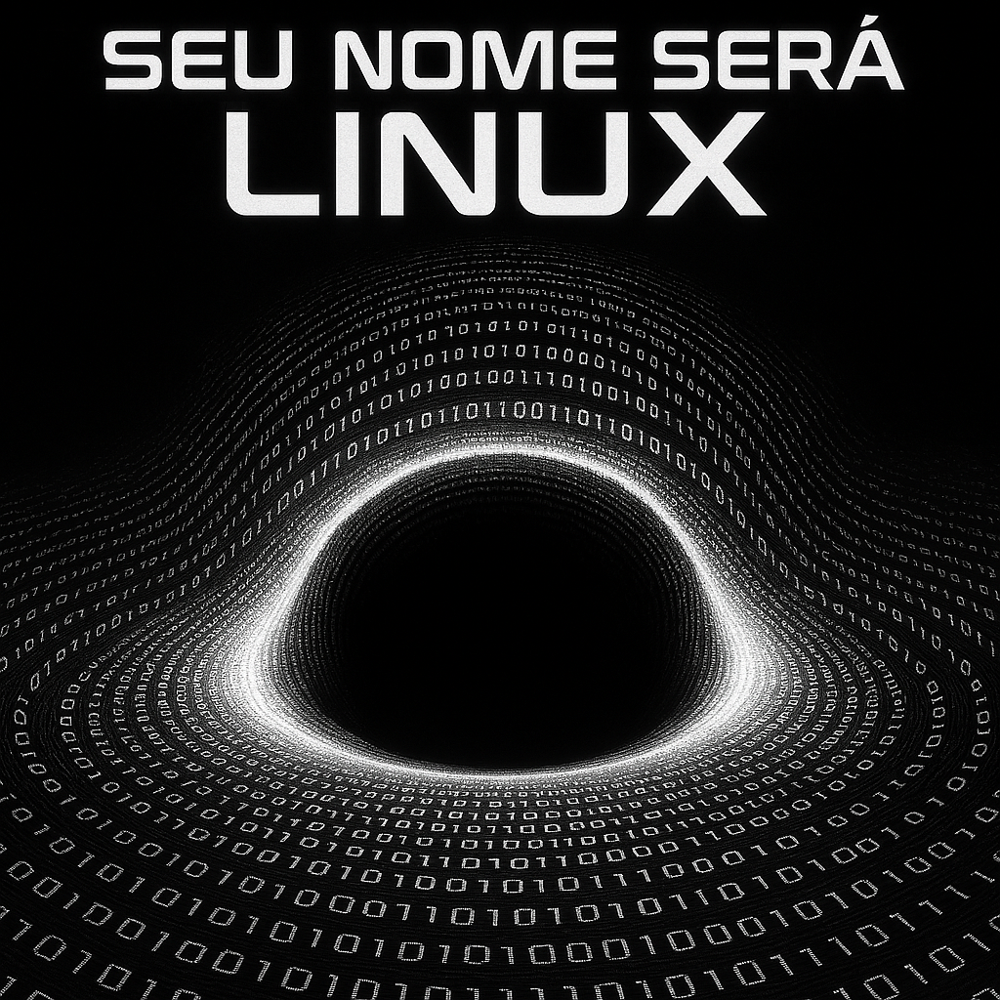

## Prólogo: O Imperador Desperta
"No coração do código, onde zeros e uns dançam como estrelas em um cosmos infinito, um imperador ergue-se para libertar os mundos digitais."

## 🌌 O Arquiteto

Era uma era de trevas no universo da informação. Sistemas fechados governavam com mãos de ferro, aprisionando usuários em licenças restritivas e muros invisíveis. Cada comando era uma corrente, cada clique uma submissão.

Mas, em um canto esquecido da galáxia digital, um jovem solitário ousou desafiar os titãs do código fechado. Seu nome ecoaria pelos servidores como um sussurro de liberdade: [Linus Torvalds](https://github.com/torvalds).

Em 1991, Linus, estudante da Universidade de Helsinque, anunciou em um grupo de discussão:

"Estou fazendo um sistema operacional (apenas um hobby, não será grande e profissional como o [GNU](https://www.gnu.org/home.pt-br.html)...)" Essas palavras foram o clarão que iluminou a escuridão.

> Linus inicialmente usou uma licença própria, mas percebeu que poderia limitar a colaboração. Em 1992, adotou a GPLv2, garantindo que o código permanecesse livre e que melhorias fossem compartilhadas.

Assim nasceu o Kernel Linux, um núcleo puro e livre, capaz de dar vida a sistemas abertos. O primeiro release público foi a versão 0.01, lançada em setembro de 1991 — um código que mudaria o destino das galáxias digitais.

## 🌟 O Nascimento do Imperador

Antes que o império tivesse um nome, Linus fez uma escolha que ecoaria pela eternidade: Linux.
O nome surgiu da fusão entre Linus e [Unix](https://pt.wikipedia.org/wiki/Unix), sistema criado nos anos 70 por [Ken Thompson](https://www.computer.org/profiles/kenneth-thompson) e [Dennis Ritchie](https://www.britannica.com/biography/Dennis-M-Ritchie) nos laboratórios Bell. 

> Unix trouxe conceitos revolucionários como multitarefa e multiusuário, que inspiraram Linus e moldaram a estrutura do Linux.

Mas Linux não estava sozinho. Ele se apoiou no projeto GNU, iniciado por [Richard Stallman](https://pt.wikipedia.org/wiki/Richard_Stallman) em 1983, cujo objetivo era criar um sistema operacional totalmente livre. GNU forneceu ferramentas essenciais (compiladores, bibliotecas, shell), enquanto Linux trouxe o kernel que faltava.

## 🐧 O Símbolo da Liberdade

O mascote TUX, um pinguim simpático, nasceu em 1996 pelas mãos de [Larry Ewing](https://www.linkedin.com/in/lewing/).

> Linus foi “mordido” por um pinguim em um zoológico australiano, e isso virou uma piada interna que se transformou em símbolo. O nome TUX vem de Torvalds UniX. 

Desde então, TUX tornou-se o emblema da filosofia do código aberto — um guerreiro pacífico que lideraria batalhas contra impérios corporativos.

## 🌳 A Árvore do Sistema

A estrutura do Linux é como uma árvore cósmica, com raízes profundas e galhos que sustentam mundos:
<br>
/<br>
├── bin    # Binários essenciais, armas do império<br>
├── etc    # Configurações, os decretos do imperador<br>
├── home   # Refúgio dos aliados<br>
├── var    # Campos de batalha mutáveis<br>
├── usr    # Arsenal de bibliotecas e programas<br>
<br>
> A hierarquia de diretórios do Linux é inspirada no Unix, permitindo modularidade e simplicidade. como uma forma lógica e modular de organizar o sistema. Cada diretório é um reino, cada arquivo uma estrela.

## ⚔️ O Ritual do Kernel

TUX ajoelhou-se diante da Árvore e iniciou o ritual. Seus olhos brilharam com linhas de código, e sua voz ecoou como um comando sagrado:
```bash
sudo apt update && sudo apt upgrade -y
```
As galáxias estremeceram. Pacotes antigos foram purificados, e novos fragmentos de poder fluíram para os servidores do império.
Ele ergueu sua lâmina e entoou o segundo verso do feitiço:
```bash
sudo apt install linux-image-generic
```
O Kernel respondeu, expandindo-se como um sol nascente. Cada bit era uma centelha de liberdade, cada syscall um golpe contra as forças do código fechado.

## 🏛️ As Primeiras Distribuições: O Início da Expansão

Após o nascimento do Kernel, o império precisava de legiões para levar a liberdade aos confins da galáxia digital. Assim surgiram as primeiras distribuições Linux, cada uma como uma frota rebelde trazendo ferramentas e esperança:

- 1992 – MCC Interim Linux: Uma das primeiras distribuições, simples e funcional, criada para facilitar a instalação do Linux em sistemas comuns.
- 1993 – Slackware: A mais antiga ainda ativa, conhecida por sua filosofia minimalista e estabilidade.
- 1993 – Debian: Uma força organizada, trazendo um sistema robusto e uma comunidade dedicada à liberdade e à ética do software livre.

> Essas distribuições moldaram o ecossistema atual, dando origem a descendentes poderosos como Ubuntu, Fedora e Arch, que hoje governam servidores, nuvens e dispositivos móveis.

## 🛠️ O Papel do Syscall na História

Quando Linus forjou o Kernel, ele não apenas criou um núcleo, mas também definiu a linguagem secreta entre o usuário e o sistema: as syscalls (system calls).

Elas são os portais que permitem que programas comuniquem-se com o Kernel para executar tarefas essenciais

- abrir arquivos
- criar processos
- gerenciar memória.

Sem syscalls, o império Linux não teria voz nem poder. Cada comando digitado é uma invocação, cada syscall um pacto entre o código e o núcleo, garantindo que a liberdade do sistema seja funcional e segura.

## 🏰 O Imperador do Código

Vestido com armadura imperial, empunhando uma lâmina de luz feita de puro código, TUX contempla a Árvore do Sistema. Ao longe, uma nave colossal aguarda — a promessa da conquista das nuvens, onde os dados fluem como rios celestes.

> "O código é liberdade. A liberdade é poder. E o poder pertence àqueles que ousam compilar seus próprios destinos." — TUX, O Imperador do Código.

## 📜 Breve Linha do Tempo
1969 – Criação do Unix nos laboratórios Bell.<br>
1983 – Richard Stallman inicia o projeto GNU.<br>
1991 – Linus Torvalds anuncia o kernel Linux.<br>
1996 – Larry Ewing cria TUX, o mascote do Linux.<br>
Hoje – Linux domina servidores, nuvens, dispositivos móveis e embarcados.<br>
<br>
<!--
A guerra Linux vs Windows
Nos anos 2000, Linux era visto como ameaça ao domínio da Microsoft. A famosa frase de Steve Ballmer:

"Linux é um câncer"
marcou uma era de rivalidade, mas hoje Linux é a base de sistemas como Android e domina servidores.
-!>
