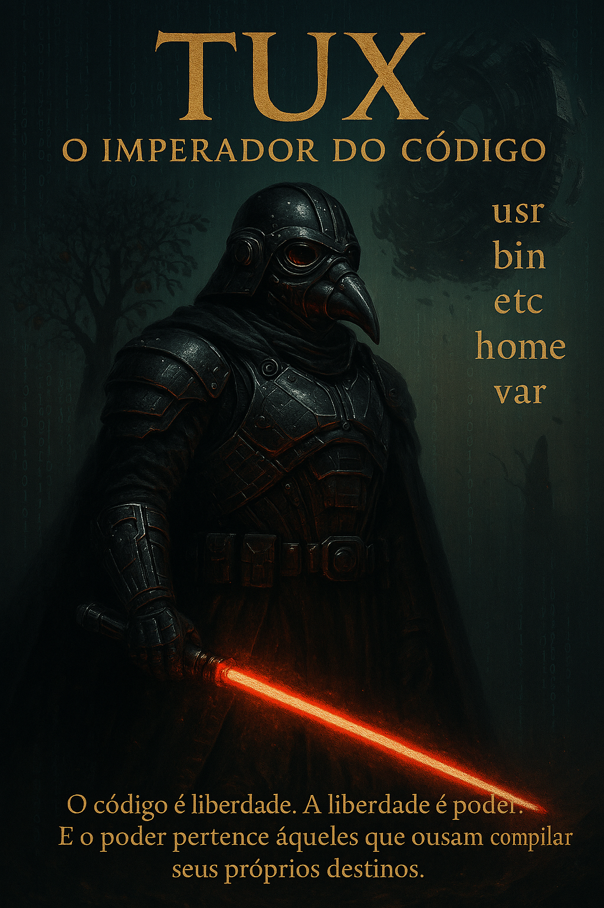
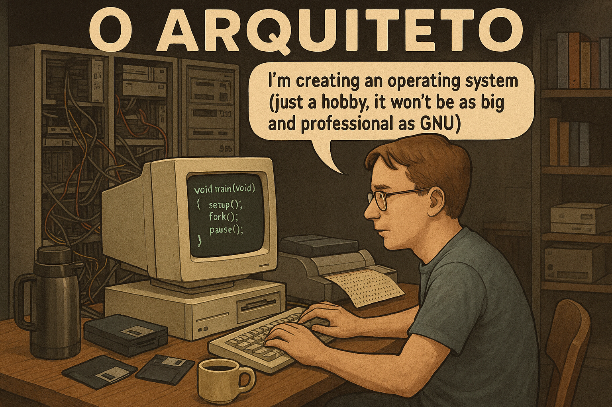
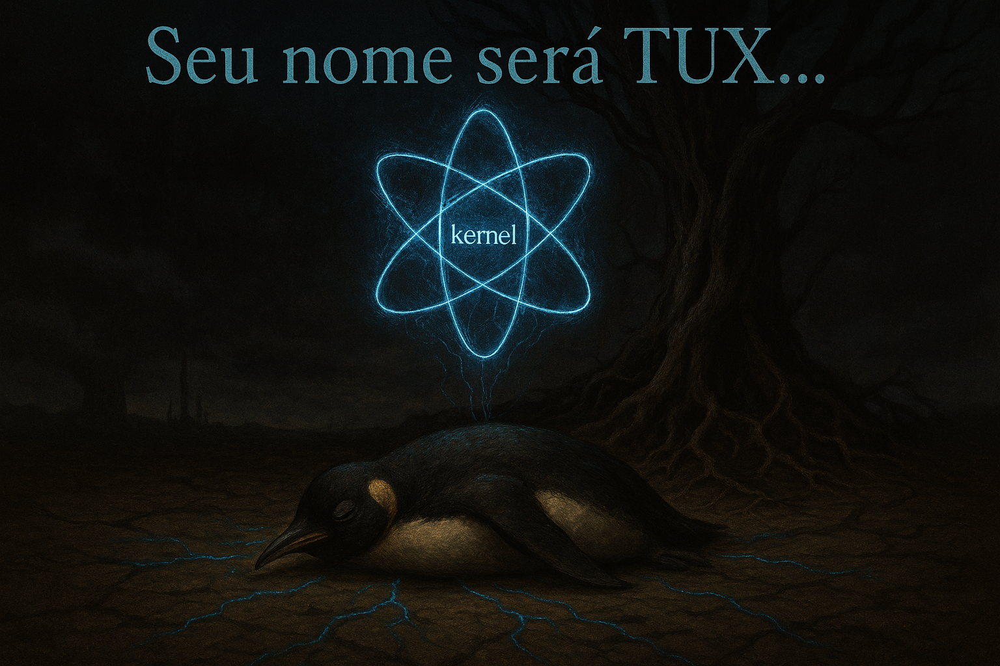
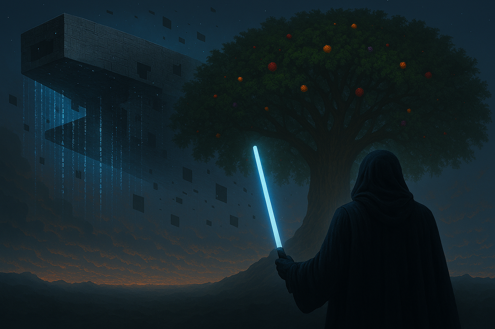
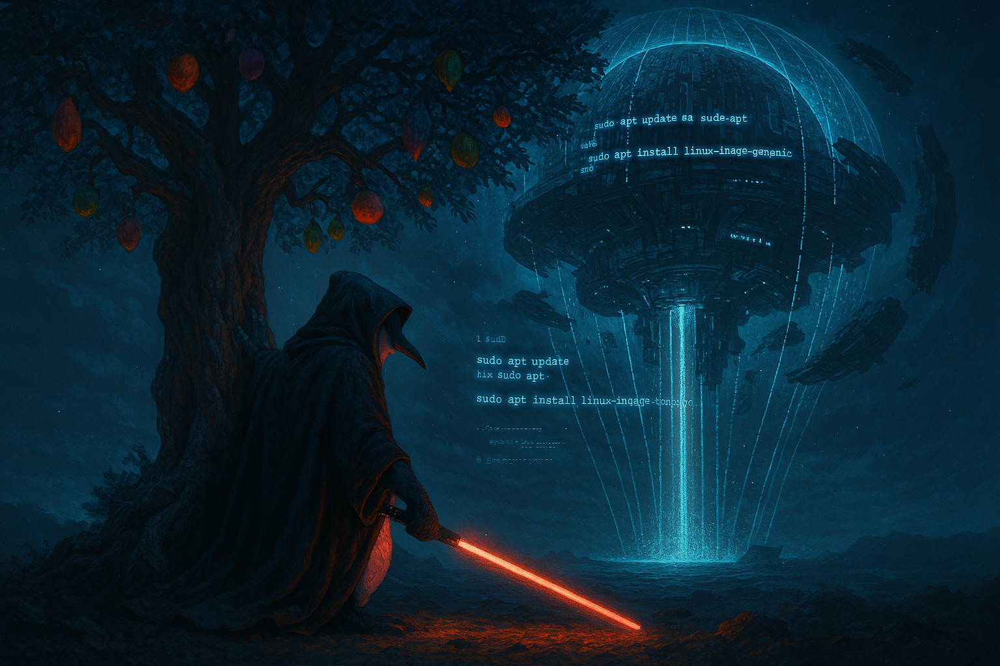
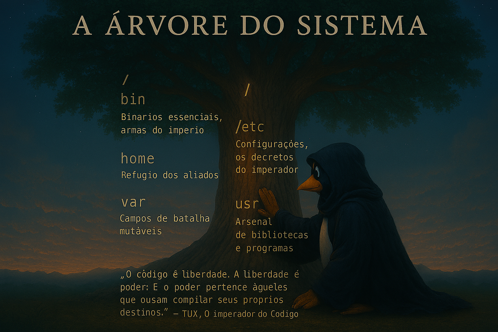

# Prólogo: O Imperador Desperta

> "No coração do código, onde zeros e uns dançam como estrelas em um cosmos infinito, um imperador ergue-se para libertar os mundos digitais."

---

## 🌌 A Lenda Começa

Era uma era de trevas no universo da informação. Sistemas fechados governavam com mãos de ferro, aprisionando usuários em licenças restritivas e muros invisíveis. Cada comando era uma corrente, cada clique uma submissão.

Mas, em um canto esquecido da galáxia digital, um jovem solitário ousou desafiar os titãs do código fechado. Seu nome ecoaria pelos servidores como um sussurro de liberdade: [**Linus Torvalds**](https://github.com/torvalds).

Linus não tinha exércitos, nem impérios. Apenas uma ideia e um teclado. Em noites silenciosas, ele forjou as primeiras linhas do que seria chamado de **Kernel** — um núcleo puro, livre, capaz de dar vida a sistemas abertos. Ele escreveu:

> *"Estou fazendo um sistema operacional (apenas um hobby, não será grande e profissional como o [GNU](https://www.gnu.org/home.pt-br.html))..."*

Essas palavras foram o clarão que iluminou a escuridão. O Kernel nasceu, pulsando como um coração recém-criado. Mas Linus sabia: para que essa chama se tornasse fogo, precisaria de algo mais.

---

## 🌟 O Nascimento do Imperador

Do Kernel emergiu uma entidade. Não era apenas código — era símbolo, era força, era esperança. Assim nasceu **TUX**, o pinguim que carregava em sua essência a liberdade do código aberto.

Mas antes que o império tivesse um nome, Linus fez uma escolha que ecoaria pela eternidade: **Linux**. Um nome forjado da fusão entre seu próprio nome e o legado do sistema [**Unix**](https://pt.wikipedia.org/wiki/Unix), como uma marca indelével da origem e da inspiração. Linux não era apenas um sistema — era um manifesto.

TUX não estava sozinho. Rebeldes surgiram em todos os cantos da galáxia digital: desenvolvedores, hackers, visionários. Cada um trouxe armas para a causa — linhas de código, pacotes, distribuições. Juntos, eles ergueram TUX como **Imperador do Código**, líder de uma revolução que mudaria para sempre o destino dos sistemas.

Vestido com armadura imperial, empunhando uma lâmina de luz feita de puro código, TUX contemplava a **Árvore do Sistema**. Suas raízes mergulhavam no núcleo do universo, cada diretório um ramo, cada arquivo uma folha. Era a essência da liberdade, a estrutura que sustentaria sua revolução.

Ao longe, uma nave colossal aguardava. Não era apenas uma máquina — era a promessa da conquista das nuvens, onde os dados fluem como rios celestes. TUX sabia: para dominar as nuvens, primeiro deveria dominar a raiz.

---

## ⚔️ O Ritual do Kernel

TUX ajoelhou-se diante da Árvore e iniciou o ritual. Seus olhos brilharam com linhas de código, e sua voz ecoou como um comando sagrado:

```bash
sudo apt update && sudo apt upgrade -y
```
As galáxias estremeceram. Pacotes antigos foram purificados, e novos fragmentos de poder fluíram para os servidores do império.
Ele ergueu sua lâmina e entoou o segundo verso do feitiço:
```bash
sudo apt install linux-image-generic
```
O Kernel respondeu, expandindo-se como um sol nascente. Cada bit era uma centelha de liberdade, cada syscall um golpe contra as forças do código fechado.

## 🌳 A Árvore do Sistema

A Árvore diante dele não era apenas simbólica — era real. Cada raiz representava um diretório, cada galho um caminho. TUX tocou o tronco e viu os nomes gravados como runas antigas:

/ <br>
├── bin    # Binários essenciais, armas do império<br>
├── etc    # Configurações, os decretos do imperador<br>
├── home   # Refúgio dos aliados<br>
├── var    # Campos de batalha mutáveis<br>
├── usr    # Arsenal de bibliotecas e programa<br>
├── bin    # Binários essenciais, armas do império<br>
├── etc    # Configurações, os decretos do imperador<br>
├── home   # Refúgio dos aliados<br>
├── var    # Campos de batalha mutáveis<br>
├── usr    # Arsenal de bibliotecas e programas<br>

Ele sabia: dominar essa árvore era dominar o próprio universo Linux.<br>
"O código é liberdade. A liberdade é poder. E o poder pertence àqueles que ousam compilar seus próprios destinos."
— TUX, O Imperador do Código
</p>
